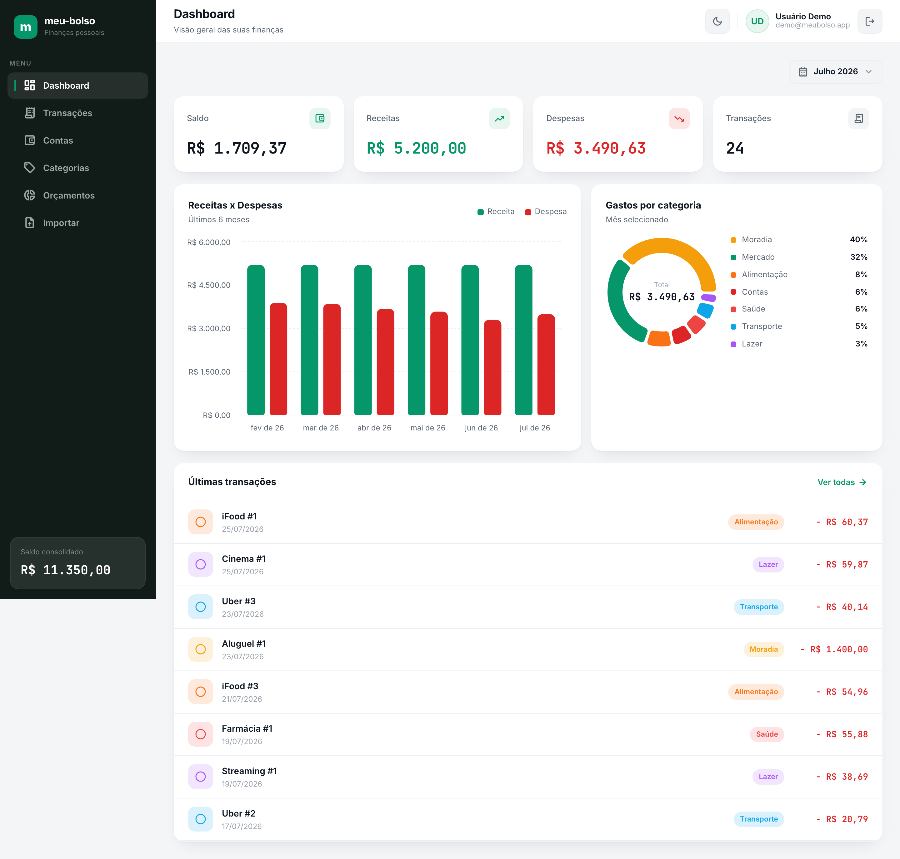
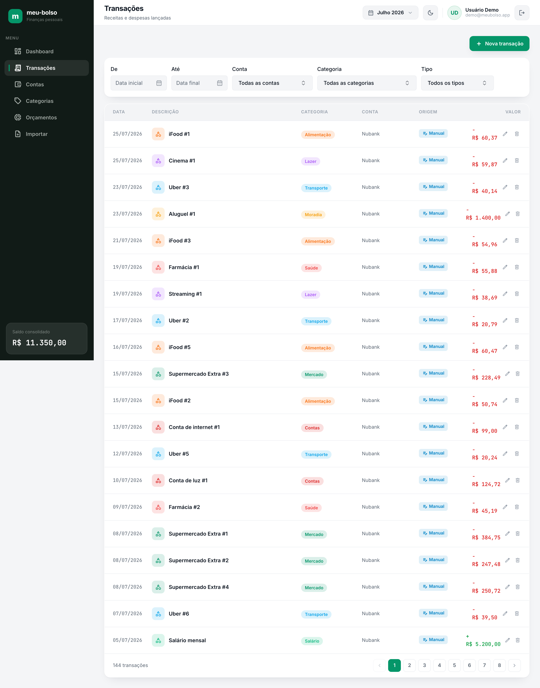
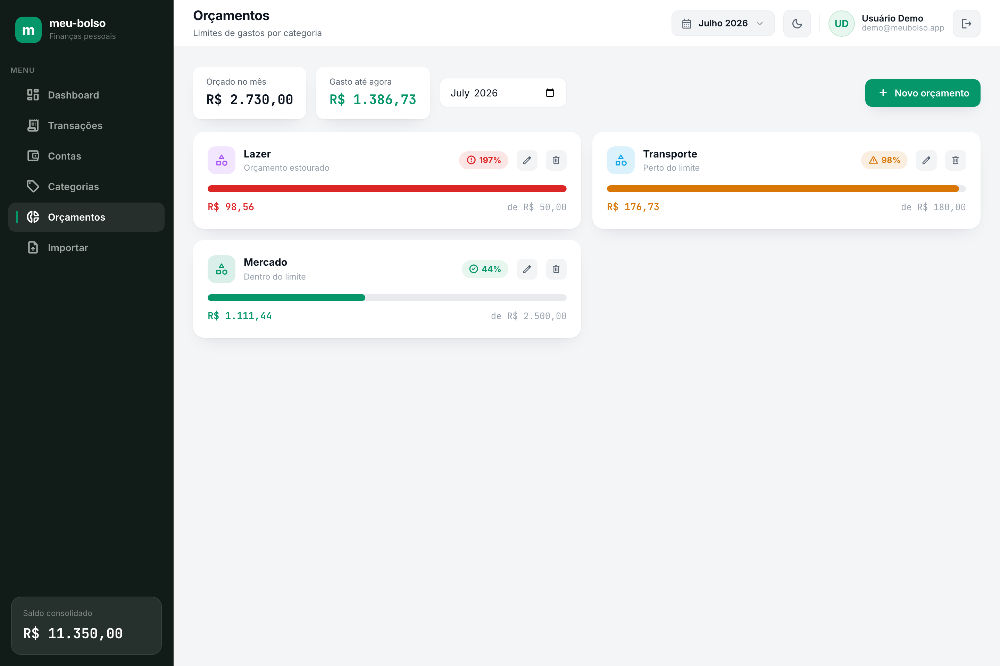

# meu-bolso 💰

[](https://github.com/editzffaleta/meu-bolso/actions/workflows/ci.yml)
[](./LICENSE)

Dashboard de **finanças pessoais** full-stack: importe extratos bancários em **CSV/OFX**, tenha os
gastos **categorizados automaticamente** e acompanhe para onde o dinheiro vai em **gráficos mensais**.

> Projeto pessoal — construído para praticar arquitetura full-stack limpa de ponta a ponta
> (domínio → API → UI), com testes e CI.

## 📸 Telas



<p align="center">
  
  
</p>

## ✨ Funcionalidades

- **Contas** — cadastre contas/carteiras (corrente, poupança, carteira, cartão).
- **Transações** — lançamento manual e listagem com filtros por período, conta, categoria e tipo.
- **Importação CSV/OFX** — upload de extrato, parsing, deduplicação e criação automática das transações.
- **Categorização automática** — regras `palavra-chave → categoria` aplicadas na importação, com
  recategorização em massa.
- **Orçamentos** — limite de gasto por categoria/mês com acompanhamento de consumo.
- **Dashboard** — saldo, receitas × despesas, gasto por categoria e evolução mensal em gráficos.
- **Multiusuário** — cada pessoa acessa somente os próprios dados (autenticação JWT).

## 🧱 Stack

| Camada | Tecnologia |
|---|---|
| Monorepo | Turborepo + npm workspaces |
| Backend | NestJS (TypeScript) · porta 4000 |
| Frontend | Next.js (App Router) · porta 3000 |
| Banco | PostgreSQL + Prisma |
| Gráficos | Recharts |
| Testes | Jest (unit/integração) + Playwright (e2e) |

Arquitetura em camadas (Clean Architecture + DDD): o domínio não depende de framework nem de ORM;
os casos de uso recebem *ports* e a persistência Prisma as implementa.

## 🚀 Rodando localmente

Pré-requisitos: **Node 20+**, **npm** e um **PostgreSQL** acessível.

```bash
# 1. dependências
npm install

# 2. variáveis de ambiente (copie e ajuste)
cp apps/backend/.env.example apps/backend/.env
cp apps/frontend/.env.example apps/frontend/.env

# 3. banco (migrations)
npm run db:migrate --workspace @meubolso/backend

# 4. subir backend (:4000) + frontend (:3000)
npm run dev
```

Acesse `http://localhost:3000`.

## 🎬 Rodar dados de demonstração

Para abrir o dashboard já populado (contas, categorias, ~6 meses de transações, regras de
categorização e orçamentos), rode o seed de demonstração após subir o banco e aplicar as
migrations:

```bash
# garanta que SEED_DEMO_PASSWORD está definida em apps/backend/.env
# (valor de exemplo documentado em apps/backend/.env.example)
npm run seed:demo
```

Depois, faça login com `demo@meubolso.app` e a senha definida em `SEED_DEMO_PASSWORD`. O script é
idempotente — pode ser executado novamente sem duplicar dados.

## 📂 Estrutura

```
apps/
  backend/    # API NestJS — controllers, adapters Prisma, wiring (interface + infra)
  frontend/   # UI Next.js (App Router)
  e2e/        # testes end-to-end (Playwright)
modules/      # domínio puro por bounded context (accounts, categories, transactions,
              # imports, budgets, analytics, auth) — entidades, casos de uso e ports
packages/
  shared/     # contratos base, erros de domínio, regras de validação
```

## 🏛️ Decisões de arquitetura

- **Domínio isolado de framework e ORM.** Cada módulo em `modules/*` é um pacote independente com
  entidades, casos de uso (`UseCase<In, Out>`) e *ports* (interfaces). Nada ali importa NestJS ou
  Prisma. O `apps/backend` é só a camada de interface/infra: controllers finos que instanciam os
  casos de uso e implementações Prisma que satisfazem as ports. Isso mantém a regra de dependência
  (domínio ← aplicação ← infraestrutura) e deixa a lógica testável sem banco (fakes em memória).

- **Isolamento por usuário como invariante.** Não há multi-tenancy nem RBAC: o modelo é
  multiusuário simples. **Toda** query e endpoint é escopado por `userId` (lido do JWT, nunca do
  corpo/query), e a posse de recursos referenciados (conta/categoria de uma transação) é validada
  no caso de uso. Testado cruzando dois usuários em cada módulo (acesso ao dado alheio → `404`).

- **Autenticação stateless com JWT.** O domínio de `auth` não conhece token/sessão — apenas valida
  credenciais. A camada HTTP assina o JWT (`{ sub, name, email }`); o frontend guarda em cookie e
  um *guard* protege o grupo de rotas privadas.

- **Importação idempotente por *fingerprint*.** Extratos CSV/OFX são parseados por *ports*
  dedicadas (`CsvStatementParser`/`OfxStatementParser`). Cada lançamento recebe um *fingerprint*
  (hash de data+valor+descrição) usado para deduplicar reimportações. O índice único é **parcial**
  (`WHERE source = 'import'`), então lançamentos manuais idênticos e legítimos continuam permitidos.

- **Categorização desacoplada por *port* estrutural.** Como `transactions` já depende de
  `categories`, evitou-se o ciclo inverso: `categories` expõe uma port estrutural
  (`TransactionCategorizationPort`) e o *adapter* concreto vive na infraestrutura. A importação
  chama `apply-rules` ao final, então transações já nascem categorizadas.

- **Agregações somente-leitura para o dashboard.** O módulo `analytics` não persiste nada — calcula
  `summary`, gasto por categoria e evolução mensal via *aggregate/groupBy* do Prisma, sempre
  escopado por `userId`. O frontend renderiza com **Recharts**, com as cores reais das categorias.

- **Monorepo Turborepo.** `lint`/`check-types`/`test` dependem do `^build` dos pacotes de domínio
  (que expõem tipos via `dist/`), garantindo ordem correta de build no CI a partir de um checkout
  limpo.

## 🧪 Qualidade

```bash
npm run lint        # ESLint
npm run test        # testes unitários/integração
npm run build       # build de produção
```

CI no GitHub Actions roda lint, typecheck, testes e build a cada push/PR.

## 📄 Licença

MIT.
